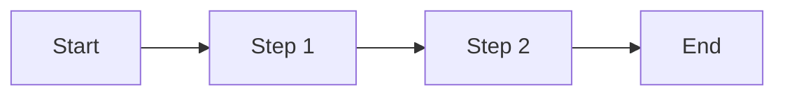

# Main Requirements Document

## Document Information
- **Project:** [Project Name]
- **Version:** 1.0
- **Created:** [YYYY-MM-DD]
- **Last Updated:** [YYYY-MM-DD]
- **Status:** [Draft / Approved / In Progress]

## Executive Summary
[2-3 paragraphs describing the project, its purpose, and key goals]

## Business Context

### Problem Statement
[What problem does this project solve?]

### Goals
1. [Goal 1]
2. [Goal 2]
3. [Goal 3]

### Success Metrics
- [Metric 1]: [Target]
- [Metric 2]: [Target]

## Stakeholders

| Role | Name | Responsibilities | Contact |
|------|------|------------------|---------|
| [Role] | [Name] | [Responsibilities] | [Email] |

## User Roles

### Role 1: [Role Name]
- **Description:** [Who they are]
- **Goals:** [What they want to achieve]
- **Permissions:** [What they can access]

### Role 2: [Role Name]
[Same structure...]

## Functional Requirements

### Feature 1: [Feature Name]

#### Description
[Detailed description of the feature]

#### User Stories
- As a [role], I want to [action], so that [benefit]
- As a [role], I want to [action], so that [benefit]

#### Acceptance Criteria
- [ ] [Criterion 1]
- [ ] [Criterion 2]

#### Business Rules
1. [Rule 1]
2. [Rule 2]

#### Mockups/Wireframes
[Link to designs or embed images]

---

### Feature 2: [Feature Name]
[Repeat structure above for each major feature]

---

## Non-Functional Requirements

### Performance
- Page load time: < X seconds
- API response time: < Y ms
- Concurrent users: X
- Database query time: < Z ms

### Security
- Authentication: [Requirements]
- Authorization: [Requirements]
- Data encryption: [Requirements]
- Compliance: [Standards to meet]

### Scalability
- Initial load: [X users]
- Growth projection: [Y users in Z months]
- Scaling strategy: [Horizontal / Vertical]

### Usability
- Accessibility: [WCAG level]
- Browser support: [List]
- Mobile responsive: [Yes/No]
- Internationalization: [Languages]

### Reliability
- Uptime: [X%]
- Backup frequency: [Daily/Weekly]
- Disaster recovery: [RTO/RPO]

### Maintainability
- Code documentation: [Required]
- Test coverage: [X%]
- Deployment frequency: [Weekly/Monthly]

## Data Requirements

### Data Entities
1. **[Entity Name]**
   - Field 1: [Type, Required/Optional, Validation]
   - Field 2: [Type, Required/Optional, Validation]

### Data Relationships
[Describe relationships between entities]

### Data Volume
- Initial: [X records]
- Growth: [Y records/month]
- Storage: [Z GB]

### Data Retention
- Active data: [Duration]
- Archived data: [Duration]
- Deletion policy: [Policy]

## Integration Requirements

### External Systems
| System | Purpose | Integration Method | Data Flow |
|--------|---------|-------------------|-----------|
| [System] | [Purpose] | [API/Webhook/etc] | [Inbound/Outbound] |

### APIs
- [API 1]: [Purpose and usage]
- [API 2]: [Purpose and usage]

## Workflow & Business Processes

### Process 1: [Process Name]

**Steps:**
1. [Detailed step 1]
2. [Detailed step 2]

---

## Email/Notification Requirements

### Email Templates
| Template | Trigger | Recipients | Content |
|----------|---------|------------|---------|
| [Name] | [When sent] | [Who receives] | [What it contains] |

### Notification Rules
- [Rule 1]
- [Rule 2]

## Reporting Requirements

### Report 1: [Report Name]
- **Purpose:** [What it shows]
- **Frequency:** [When generated]
- **Format:** [PDF/Excel/Dashboard]
- **Data:** [What data included]
- **Access:** [Who can view]

## Constraints

### Technical Constraints
- [Constraint 1]
- [Constraint 2]

### Business Constraints
- Budget: [Amount]
- Timeline: [Duration]
- Resources: [Available resources]

### Regulatory Constraints
- [Regulation 1]
- [Regulation 2]

## Assumptions
- [Assumption 1]
- [Assumption 2]

## Dependencies
- [Dependency 1]
- [Dependency 2]

## Out of Scope
[Explicitly list what this project will NOT include]
- [Item 1]
- [Item 2]

## Future Enhancements
[Features considered for future versions]
- [Enhancement 1]
- [Enhancement 2]

## Glossary
| Term | Definition |
|------|------------|
| [Term] | [Definition] |

## Appendix

### Appendix A: [Title]
[Additional supporting information]

---

**Approval**

| Role | Name | Signature | Date |
|------|------|-----------|------|
| [Role] | [Name] | [Signature] | [Date] |

**Document History**

| Version | Date | Author | Changes |
|---------|------|--------|---------|
| 1.0 | YYYY-MM-DD | [Name] | Initial version |
