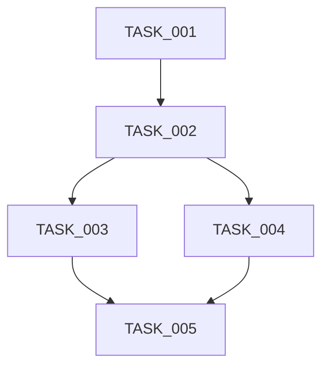

# Implementation Plan: Phase [X] - [Phase Name]

## Overview
- **Phase:** [X]
- **Phase Name:** [Name]
- **Created:** [YYYY-MM-DD]
- **Target Start:** [YYYY-MM-DD]
- **Target End:** [YYYY-MM-DD]

## Objectives
[What this phase will accomplish]

## Technical Strategy

### Architecture Decisions
[Key architectural choices for this phase]

### Design Patterns
[Patterns to be used: MVC, Repository, Factory, etc.]

### Code Organization
```
src/
├── [module1]/
│   ├── components/
│   ├── services/
│   └── models/
└── [module2]/
```

## Technology Stack

### Core Technologies
- **Language:** [e.g., JavaScript/TypeScript]
- **Framework:** [e.g., React, Express]
- **Database:** [e.g., PostgreSQL]

### Libraries & Dependencies
| Library | Version | Purpose | Justification |
|---------|---------|---------|---------------|
| [name] | X.Y.Z | [What it does] | [Why chosen] |

## Database Design

### New Tables/Collections
```sql
-- Table 1
CREATE TABLE table_name (
  id SERIAL PRIMARY KEY,
  field1 VARCHAR(255),
  ...
);
```

### Migrations
- [ ] Migration 1: [Description]
- [ ] Migration 2: [Description]

### Indexes
- [ ] Index on [table].[column] for [reason]

## API Design

### New Endpoints
| Method | Endpoint | Description | Auth Required |
|--------|----------|-------------|---------------|
| POST | /api/resource | [Purpose] | Yes/No |
| GET | /api/resource/:id | [Purpose] | Yes/No |

### Request/Response Examples
```json
// POST /api/resource
{
  "field": "value"
}

// Response
{
  "id": 1,
  "field": "value"
}
```

## Implementation Sequence

### Step 1: [Foundation Setup]
**Tasks:** [TASK_001, TASK_002]
**Purpose:** [Why these first]
**Deliverables:**
- [Deliverable 1]

### Step 2: [Core Functionality]
**Tasks:** [TASK_003, TASK_004, TASK_005]
**Purpose:** [Why in this order]
**Deliverables:**
- [Deliverable 1]

### Step 3: [Integration & Testing]
**Tasks:** [TASK_006, TASK_007]
**Purpose:** [Why last]
**Deliverables:**
- [Deliverable 1]

## Task Breakdown with Dependencies



| Task | Depends On | Estimated Hours |
|------|-----------|----------------|
| TASK_001 | None | X |
| TASK_002 | TASK_001 | Y |

## Code Standards for This Phase

### Naming Conventions
- **Variables:** camelCase
- **Functions:** camelCase
- **Classes:** PascalCase
- **Constants:** UPPER_SNAKE_CASE
- **Files:** kebab-case

### File Structure Template
```javascript
// Imports
import { something } from 'library';

// Types/Interfaces (if TypeScript)
interface MyInterface {}

// Constants
const CONFIG = {};

// Main implementation
export const myFunction = () => {
  // Code
};
```

### Comments Strategy
- Function/class headers: JSDoc format
- Complex logic: Inline comments
- TODO/FIXME: With issue references

## Error Handling Strategy

### Error Types
```javascript
class ValidationError extends Error {}
class DatabaseError extends Error {}
class AuthenticationError extends Error {}
```

### Error Responses
```json
{
  "error": {
    "code": "ERROR_CODE",
    "message": "User-friendly message",
    "details": {}
  }
}
```

## Security Considerations

### Authentication
- [How auth is implemented]
- [Token strategy]

### Authorization
- [Role-based access control approach]

### Input Validation
- [Validation library/approach]
- [Sanitization strategy]

### Data Protection
- [Encryption at rest]
- [Encryption in transit]
- [Sensitive data handling]

## Testing Strategy

### Unit Tests
- **Target Coverage:** X%
- **Framework:** [Jest, Mocha, etc.]
- **What to test:**
  - [ ] Business logic
  - [ ] Utilities
  - [ ] Services

### Integration Tests
- **Framework:** [Supertest, etc.]
- **What to test:**
  - [ ] API endpoints
  - [ ] Database operations
  - [ ] External service integrations

### E2E Tests
- **Framework:** [Cypress, Playwright, etc.]
- **What to test:**
  - [ ] Critical user flows
  - [ ] Authentication flow
  - [ ] Main features

## Performance Considerations

### Optimization Goals
- API response time: < X ms
- Page load time: < Y ms
- Database query time: < Z ms

### Strategies
- [ ] Database indexing
- [ ] Caching (Redis/Memory)
- [ ] Query optimization
- [ ] Code splitting
- [ ] Lazy loading

## Monitoring & Logging

### Logging Strategy
- **Library:** [Winston, Morgan, etc.]
- **Log Levels:** Error, Warn, Info, Debug
- **What to log:**
  - [ ] Errors
  - [ ] API requests
  - [ ] Database operations
  - [ ] Authentication events

### Monitoring
- [ ] Error tracking: [Sentry, etc.]
- [ ] Performance monitoring
- [ ] Uptime monitoring

## Deployment Strategy

### Build Process
```bash
npm run build
npm run test
npm run lint
```

### Environment Variables
```
DATABASE_URL=
API_KEY=
JWT_SECRET=
```

### Deployment Checklist
- [ ] Environment variables set
- [ ] Database migrated
- [ ] Tests passing
- [ ] Build successful
- [ ] Health check endpoint working

## Rollback Plan
[How to rollback if something goes wrong]
1. [Step 1]
2. [Step 2]

## Risk Mitigation

| Risk | Impact | Mitigation Strategy |
|------|--------|-------------------|
| [Risk description] | High/Med/Low | [How to prevent/handle] |

## Documentation Requirements

### Code Documentation
- [ ] All public APIs documented
- [ ] Complex functions explained
- [ ] README updated

### User Documentation
- [ ] Feature documentation
- [ ] API documentation
- [ ] Configuration guide

## Success Criteria
- [ ] All tasks completed
- [ ] All tests passing (>X% coverage)
- [ ] No critical bugs
- [ ] Performance targets met
- [ ] Security review passed
- [ ] Documentation complete
- [ ] Code reviewed
- [ ] Deployed to staging

## Review Checklist
Before marking phase complete:
- [ ] Code quality reviewed
- [ ] Tests comprehensive
- [ ] Security validated
- [ ] Performance acceptable
- [ ] Documentation complete
- [ ] User acceptance obtained

---

**Created By:** [Name]
**Reviewed By:** [Name]
**Approved:** [Yes/No]
**Last Updated:** [YYYY-MM-DD]
